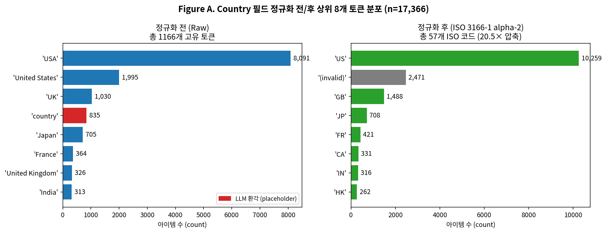
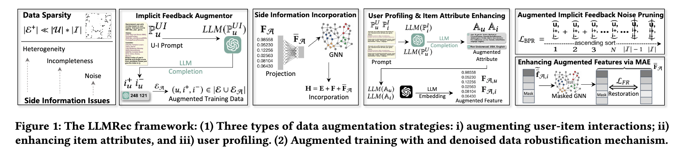
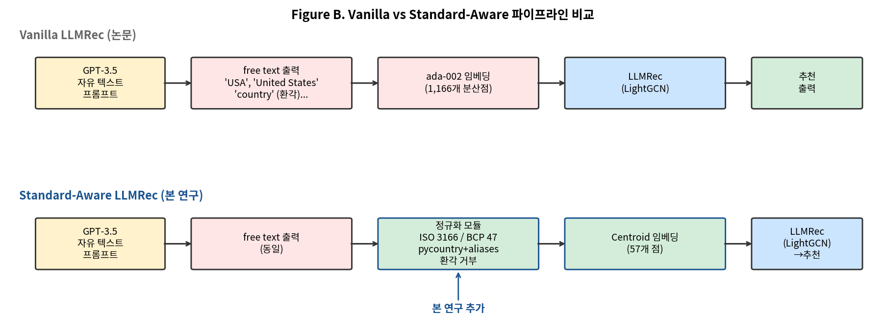

# 표준학개론 (INTRODUCTION TO STANDARDS) 기말 텀페이퍼 — 프로포절

## 국제 메타데이터 표준을 통합한 LLM 기반 그래프 증강 추천시스템
**Standard-Aware LLM Graph Augmentation for Recommendation:
A Quantitative Trade-off Analysis between Recommendation Performance and Metadata Standard Compliance**

— 멀티모달 증강을 통한 추천시스템 Cold-Start 문제 해결을 위한 선행 연구 —

---

## 1. 연구 배경 및 동기

추천시스템에서 **데이터 희소성**은 신규/저활동 사용자·아이템에 대한 추천을 어렵게 만드는 cold-start 문제의 근원이다. 최근 Wei et al.(WSDM '24)이 제안한 **LLMRec**은 GPT-3.5에게 사용자 시청 이력과 아이템 정보를 입력하여 (i) 잠재적 user-item 상호작용 edge, (ii) item 속성(감독·국가·언어), (iii) user profile을 자연어로 생성·증강함으로써 GNN 기반 추천기의 학습 신호를 풍부화하는 SoTA 접근법이다.

그러나 LLMRec이 LLM에게 **자유 텍스트** 형태로 메타데이터를 생성하도록 지시하는 설계는 표준학적 관점에서 구조적 문제를 노정한다. 본 연구의 사전 데이터 분석(LLMRec 공개 `augmented_attribute_dict`, n=17,366) 결과 다음 세 가지 표준 미준수 패턴이 확인된다.

| 패턴 | 정량 증거 |
|---|---|
| **표면 분산** | 동일 미국이 `'USA'`(8,091건) / `'United States'`(1,995건) / `'America'` 등 1,166개 토큰으로 분산 (ISO 3166 표준은 ~250개) |
| **LLM 환각** | `'country'` 단어가 국가명 자리에 835건 등장 — placeholder 환각 |
| **컬럼 시프트** | `'USA'`(국가명)가 언어 자리에 492건 등장 — 자유 텍스트 파싱 오류 |

Figure 1은 본 연구가 사전 분석한 LLMRec augmented data의 country 필드 토큰 분포이다. 좌측의 빨간색 막대(`'country'` 835건)는 LLM 환각이며, 우측은 본 연구가 적용할 ISO 3166-1 alpha-2 정규화의 *예상* 효과를 시각화한다. 동일 의미 토큰이 단일 표준 코드로 응축될 수 있는 가능성이 정량적으로 확인된다.

*Reference: LLMRec 공식 repository 제공 augmented item attribute dictionary 스크린샷. `'USA'`, `'United States'`, `'UK'`, `'France'` 등 비표준 자유 텍스트가 그대로 저장된 상태가 확인된다.*

이러한 표준 미준수는 임베딩 공간에서 의미적으로 동일한 속성이 분산되어 cold-start 일반화 성능을 저해할 가능성이 있으며, 외부 시스템 간 메타데이터 상호운용성도 확보되지 않는다. 본 연구는 schema.org/Movie, ISO 3166-1 alpha-2(국가), BCP 47(언어), ISO 8601(날짜) 등 국제 표준을 LLMRec 파이프라인에 명시적으로 통합하고, **추천 성능과 표준 적합성 간의 트레이드오프를 정량적으로 분석**할 것이다. 본 연구는 표준 준수가 데이터 기반 AI 시스템의 성능과 상호운용성에 미치는 영향을 실증적으로 규명하는 표준학적 사례 연구로 자리매김한다.

## 2. 연구 목표 및 연구 질문

본 연구는 다음 세 가지 연구 질문(RQ)에 답하는 것을 목표로 한다.

- **RQ1.** LLM 기반 데이터 증강 결과에 국제 메타데이터 표준(schema.org/Movie, ISO 639/3166)을 적용하면 추천 성능(Recall@K, NDCG@K)에 어떤 영향을 미치는가?
- **RQ2.** 표준 적용의 효과는 시나리오별로 어떻게 달라지는가? 특히 long-tail 아이템, 희소 국가·언어 카테고리 등 표준이 효과를 발휘할 수 있는 특정 조건을 식별한다.
- **RQ3.** 추천 성능과 표준 적합성·상호운용성 간의 트레이드오프를 어떻게 정량화하고 평가할 수 있는가?

본 연구는 단순한 성능 향상 주장이 아니라, 표준학적 관점에서 정당화 가능한 트레이드오프 분석 결과를 제시하는 것을 목표로 한다.

## 3. 연구 내용 및 방법

### 3.1 베이스라인 재현

LLMRec 공식 공개 코드(github.com/HKUDS/LLMRec) 와 GPT-3.5-turbo로 사전 생성된 augmented dataset을 활용하여 Netflix 데이터셋에서 베이스라인을 재현한다. 저자가 공개한 augmented dataset(LLM이 사전 생성한 메타데이터)을 그대로 활용함으로써 OpenAI API 호출 비용을 최소화한다. 1차 목표 성능은 논문에 보고된 Recall@20 = 0.0829 수준으로 설정한다.

### 3.2 Standard-Aware 통합 — 2단계 분리

본 연구는 표준 통합을 **(A) Prompt-time 설계** 와 **(B) Post-hoc 정규화** 두 단계로 분리한다.

*Figure 2. LLMRec 원본 프레임워크 — (1) u-i edge 증강, (2) item 속성 증강, (3) user profile 증강의 3가지 LLM 기반 증강 전략 + denoising. 본 연구는 이 파이프라인 위에 표준 통합 모듈을 추가할 것이다.*

#### Stage A. Standard-Aware Prompting *설계* (정성)

LLMRec의 자유 텍스트 프롬프트(`P_I`, `P_U`, `P_UI`)를 schema.org/Movie JSON-LD 어휘와 ISO 표준 코드 체계에 정합하도록 재설계한 템플릿을 제시한다. 핵심 설계 원칙:
- 출력 포맷을 JSON-LD with `@context: schema.org/Movie`로 강제
- `countryOfOrigin: ISO 3166-1 alpha-2`, `inLanguage: BCP 47`, `datePublished: ISO 8601`, `contentRating: MPAA`, `genre: schema.org / EIDR vocabulary`
- 미상 시 `null` 강제 → LLM 환각 차단

본 텀페이퍼 범위에서는 LLM 재호출을 수행하지 않으며 (OpenAI API 비용 회피, 일정 단축), 본 설계 자산은 졸업논문 단계의 sLLM(Llama-3-8B) 재증강 실험에 재사용될 예정이다.

#### Stage B. 후처리 정규화 모듈 (정량 실험의 핵심)

LLMRec이 생성한 자유 텍스트를 ISO 표준 코드로 매핑하는 정규화 모듈(약 150줄 규모)을 구현한다.

- `pycountry` 라이브러리 lookup (ISO 3166, ISO 639)
- 별칭 사전 (`USA`/`United States`/`America` → `US`; `UK`/`United Kingdom` → `GB`; `Soviet Union` → `RU` 등)
- 컬럼 시프트 거부 휴리스틱 (국가 코드가 언어 자리에 등장 시 invalid 처리)
- 환각 토큰 거부 (`country`, `language`, `n/a`, `unknown` 등 placeholder)

#### Centroid 기반 임베딩 갱신

표준 적합성의 임베딩 공간 효과를 추가 LLM 호출 없이 시뮬레이션하기 위해, 동일 표준 코드(예: `'US'`)로 정규화된 모든 아이템의 기존 ada-002 임베딩의 centroid를 계산하여 그룹 전체에 동일하게 할당한다. 이는 prompt-time 표준 통합의 *상한선 근사*로 해석될 수 있으며, 본 텀페이퍼의 정량 실험 핵심 방법론이다.

### 3.3 평가 프레임워크 — 3축

본 연구는 단일 성능 지표가 아닌 다축 평가 프레임워크를 도입하여 표준 적용의 다면적 효과를 측정한다.

| 평가 축 | 지표 | 측정 목적 |
|---|---|---|
| 추천 성능 | R@10/20/50, N@10/20/50, P@20 | LLMRec 논문 동일 프로토콜 — 표준 적용 시 성능 변화 정량화 |
| 표준 적합성 | **Standard Compliance Rate (SCR)** — 본 연구 제안 | LLM 출력의 국제 표준 부합 비율 |
| 상호운용성 | **Interoperability Score (IS)** — 본 연구 제안 | 외부 시스템 메타데이터 호환성 |

**SCR_field** = (해당 필드가 이미 표준 표기인 아이템 수) / (전체 아이템 수)
**IS** = (4개 schema.org 필수 필드가 모두 정규화 가능한 아이템의 비율)

추가로 long-tail 시나리오 검증을 위해 학습 인터랙션 빈도 기준으로 cold/warm 아이템을 분리하여 별도 Recall@20을 측정한다.

## 4. 표준학적 의의

본 연구는 다음 세 가지 측면에서 표준학 영역에 기여한다.

**첫째**, schema.org/Movie, ISO 639, ISO 3166 등 다층적 국제 메타데이터 표준이 데이터 기반 AI 시스템에 어떻게 통합 가능한지 실증한다. 표준학에서 표준은 사후 정리(data cleaning)의 도구로 흔히 인식되어 왔으나, 본 연구는 LLM이 데이터를 *생성하는 시점*부터 표준이 개입하는 standard-compliant data generation 접근의 *설계 청사진(Stage A)* 과 *후처리 효과 실증(Stage B)* 을 함께 제시한다.

**둘째**, 표준 준수가 시스템 성능에 미치는 영향을 정량적으로 측정함으로써, 표준 적용의 비용-편익을 실증적으로 분석한다. 표준학 연구에서 표준 준수는 단기적 성능보다 장기적 상호운용성·확장성·생태계 호환성에 가치를 두는 것이 일반적이며, 본 연구는 이러한 트레이드오프를 AI 시스템 영역에서 정량화하는 사례 연구가 될 것이다.

**셋째**, LLM 시대 추천시스템 메타데이터 품질을 평가하기 위한 새로운 지표(**Standard Compliance Rate, Interoperability Score**)를 제안한다. 이는 향후 LLM 기반 데이터 증강 기법의 표준 적합성을 평가하기 위한 프레임워크로 확장 가능하다.

## 5. 졸업논문과의 연계성

본 프로젝트는 석사 졸업논문 「멀티모달 증강을 통한 추천시스템 Cold Start 문제 해결」의 선행 연구로 명확히 위치한다. 졸업논문은 이미지·텍스트·메타데이터를 결합한 cross-modal augmentation 기법을 제안할 예정이며, 본 프로젝트에서 검증한 표준 기반 메타데이터 정규화 모듈은 졸업논문의 텍스트 메타데이터 처리 단계로 직접 통합된다.

특히 본 연구에서 제안하는 Standard-Aware Prompting 템플릿(Stage A)과 정규화 모듈(Stage B)은 졸업논문에서 다음과 같이 확장된다:

1. **Prompt-time 표준 통합 실증** — sLLM(Llama-3-8B) 파인튜닝으로 실제 LLM 출력 수준 검증
2. **Cold-start 직접 검증** — ML-10M의 더 dense한 split + attribute-aware backbone(VBPR/MMGCN)으로 확장
3. **다 backbone 모델 무관성 검증** — LATTICE, MMSSL, MICRO 등에 표준 통합 모듈 적용
4. **EIDR/MPAA/ISO 26324 추가 표준 통합** — contentRating, duration, genre, identifier 필드까지 확장

## 6. 활용 자원

- **LLMRec 공식 코드 및 augmented dataset**: Netflix 데이터셋과 GPT-3.5-turbo로 사전 생성된 메타데이터가 모두 공개되어 있어, 베이스라인 재현 시 OpenAI API 비용이 거의 발생하지 않음
- **LLMRec 재현성 연구** (nickolat/LLMRec_reproducibility, RecSys 2025): 환경 설정 및 데이터 split 보조 자료
- **연구자 보유 sLLM 파인튜닝 코드**: 졸업논문 단계 prompt-time 검증용 (Llama-3-8B, Polyglot-Ko)
- **국제 표준 자원**: pycountry 라이브러리(ISO 3166, ISO 639), schema.org Movie vocabulary, EIDR 등록 데이터, MPAA 등 각국 등급 분류 공식 정의
- **하드웨어**: NVIDIA RTX PRO 6000 Blackwell (98GB VRAM) — LLMRec 학습 시간 ≈ 30초/실험

## 7. 연구 일정

본 프로젝트는 2026년 1학기 종강 시점(6월 말)을 마감으로 하여, 다음과 같은 단계로 수행한다.

| 시기 | 주요 작업 | 세부 내용 및 산출물 |
|---|---|---|
| 5월 2주 | 환경 구축 및 베이스라인 재현 | LLMRec 공식 repo clone, Netflix 데이터셋 환경 구축, 공개 augmented dataset으로 베이스라인 재현 (목표 R@20=0.0829) |
| 5월 3주 | Standard-Aware Prompting 설계 문서화 | schema.org/Movie 스키마 기반 P_I, P_U, P_UI 프롬프트 템플릿 작성 (LLM 재호출 없음) |
| 5월 4주 | 표준 정규화 모듈 + 임베딩 생성 | ISO 3166 / BCP 47 / MPAA 매핑 사전 구축, pycountry 활용 정규화 모듈 (~150줄), Centroid 기반 임베딩 갱신 |
| 6월 1주 | 실험 수행 | Vanilla LLMRec vs Standard-Aware LLMRec 비교 (R@K, N@K, P@20), 정규화 효과 ablation |
| 6월 2주 | 결과 분석 및 정성 평가 | 성능 트레이드오프 분석, Standard Compliance Rate / Interoperability Score 측정, 시각화 |
| 6월 3주 | 최종 보고서 및 발표 준비 | 기말 텀페이퍼 작성, 발표 자료 제작, 졸업논문 연계 방안 정리 |

## 8. 예상 한계 및 대응 방안

본 연구는 다음과 같은 한계를 가질 수 있으며, 이에 대한 대응 방안을 사전에 준비한다.

**첫째**, 표준 적용 시 LLM 임베딩의 자연어 표현력이 일부 손실되어 전체 추천 성능(Recall, NDCG)이 vanilla LLMRec 대비 동등 수준 또는 소폭 하락할 가능성이 존재한다. 이는 본 연구의 핵심 메시지가 단순한 성능 향상이 아닌 *트레이드오프 분석*에 있음을 명확히 함으로써 대응한다 — 결과가 어떤 방향으로 나오든 표준학적 해석이 가능한 연구 설계를 채택한다.

**둘째**, schema.org/Movie 스키마는 50개 이상의 필드를 포함하므로, 본 연구에서는 LLMRec 공개 데이터에 가용한 핵심 필드(director, countryOfOrigin, inLanguage, datePublished)로 범위를 한정한다. contentRating, duration, genre 등 결락 필드는 졸업논문 단계 MovieLens 확장 시 추가한다.

**셋째**, LLMRec 공개 Netflix subset의 데이터 sparsity로 인해 cold-item Recall 측정이 제한될 가능성이 있다 (학습 인터랙션 0인 아이템 비율이 높을 경우 LightGCN backbone이 추천 자체를 못 함). 이 경우 long-tail 효과는 졸업논문에서 ML-10M + attribute-aware backbone(VBPR/MMGCN)으로 재검증한다.

**넷째**, Centroid 기반 임베딩 갱신은 prompt-time 표준 통합의 *상한선 근사*이며, 실제 LLM이 표준 코드만 출력할 때 동일 효과가 나타나는지는 졸업논문 단계 sLLM 검증으로 보완한다.

---

## 참고문헌 (핵심)

1. Wei, W., Ren, X., Tang, J., et al. (2024). *LLMRec: Large Language Models with Graph Augmentation for Recommendation*. Proc. WSDM '24.
2. Malitesta, D., et al. (2025). *How Powerful are LLMs to Support Multimodal Recommendation? A Reproducibility Study of LLMRec*. Proc. RecSys '25.
3. Schema.org. *Movie - Schema.org Type*. https://schema.org/Movie
4. EIDR. *Entertainment Identifier Registry — ISO 26324-based content identifier system*. https://www.eidr.org/
5. ISO 3166-1 (2020). *Codes for the representation of names of countries — Part 1: Country code*. International Organization for Standardization.
6. ISO 639-1 (2002). *Codes for the representation of names of languages — Part 1: Alpha-2 code*. International Organization for Standardization.
7. IETF (2009). *BCP 47 / RFC 5646: Tags for Identifying Languages*.
